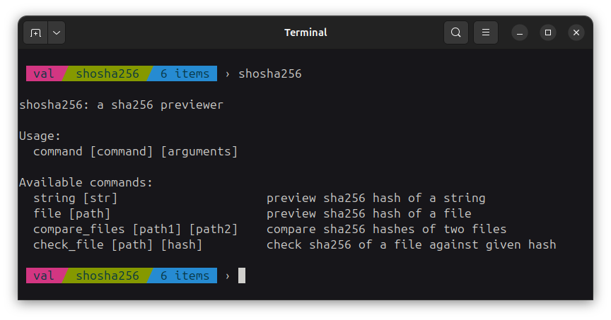
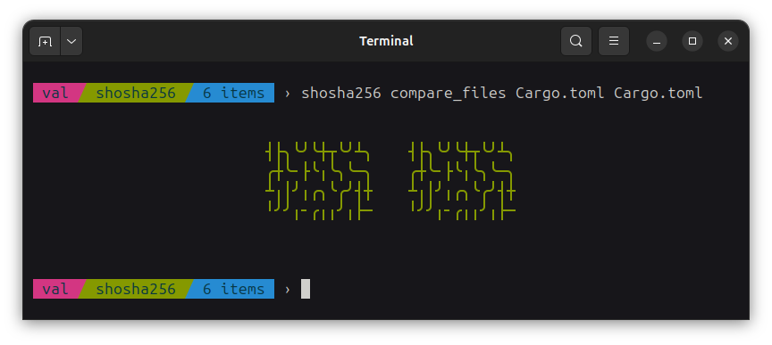

This is a sha256 previewer I made just for fun...



You can install it on your computer (assuming you have cargo installed) using:

```
cargo install shosha256
```

You can preview the sha256 hash of a string or a file:


You can also compare the hashes of two files:



