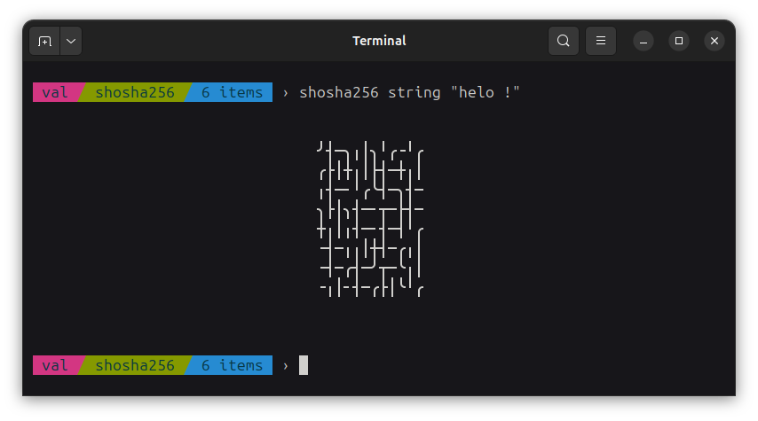
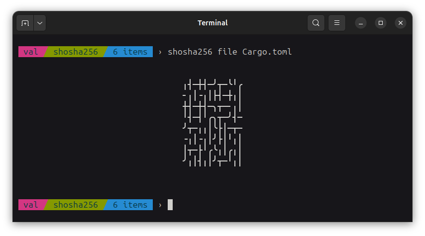
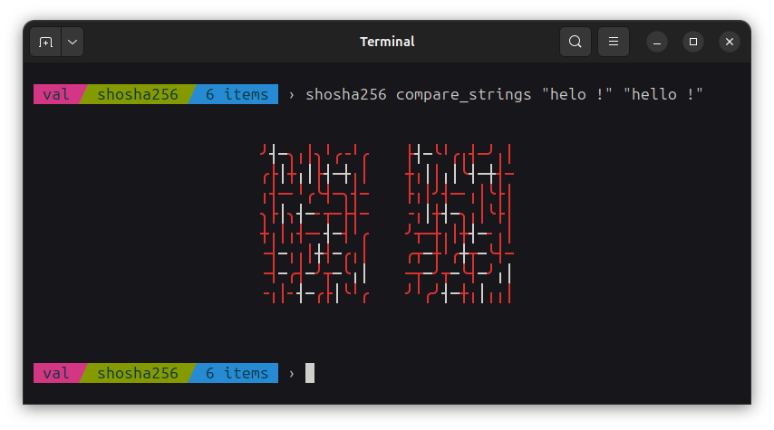
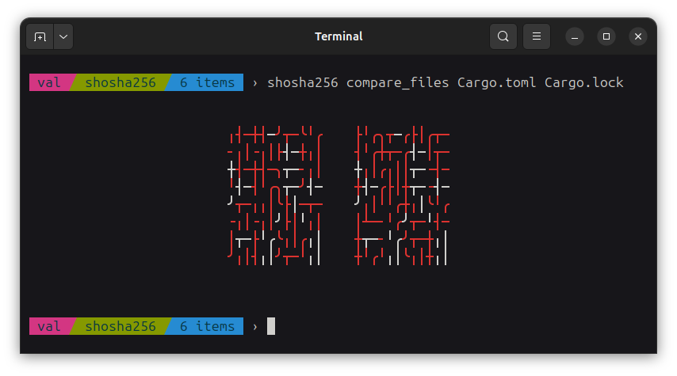

This is a sha256 previewer I made just for fun...

You can install it on your computer using (assuming you have cargo installed):

```
cargo install shosha256
```

You can preview the sha256 hash of text:



As well as preview the sha256 hash of a file:



You can also easily compare hashes of two strings or two files:




