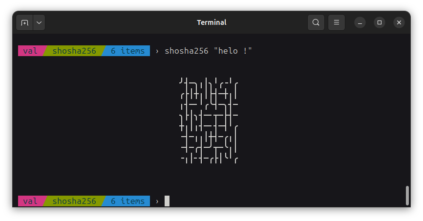
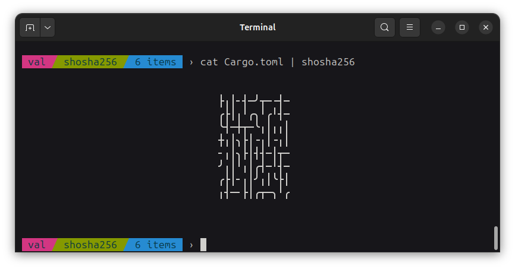

This is a sha256 previewer I made just for fun...

You can preview the sha256 hash of text:



As well as data piped to it:



You can install it on your computer by downloading the project repository and using the following command in its root directory (assuming you have cargo installed):

```
cargo install --path .
```
